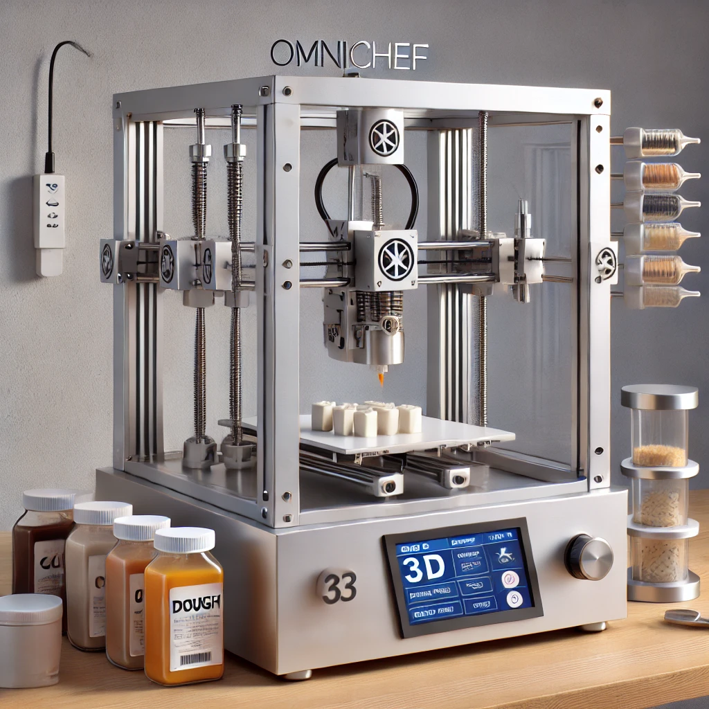

# OmniChef 3D Food Printer

OmniChef is an open-source project designed to create a versatile 3D food printer that supports:
- Multiple extruders for various food textures (chocolate, dough, sauces, purées).
- An optional IR/laser cooking module for partial cooking or caramelizing layers.
- A customizable web dashboard for uploading recipes or G-code and monitoring the printer.

> **Disclaimer**: This code and design are provided as-is and **must be adapted** to your hardware and local food-safety regulations. Always prioritize safe materials, hygiene, and correct operating procedures when dealing with edible prints.




## Features

- **Multi-Extruder** Support (up to 3 extruders in the default configuration).
- **Food-Safe Materials** recommended (stainless steel, PTFE tubing, etc.).
- **Custom G-code Macros** for IR/laser-based partial cooking.
- **Open-Source Firmware** (Marlin) with minimal modifications for food-printing needs.
- **Optional Web UI** (Node.js) to control printing, upload G-code, and track print progress.

## Repository Structure

```plaintext
omni-chef-3d-food-printer/
├── README.md
├── hardware/
│   ├── cad/
│   ├── electronics/
│   └── BOM/
├── firmware/
│   └── marlin/
│       ├── Configuration.h
│       ├── Configuration_adv.h
│       ├── cooking_macros.gcode
│       └── pins_USERMAPPING.h
├── software/
│   ├── slicer-plugins/
│   └── web-ui/
│       ├── package.json
│       ├── server.js
│       └── public/
└── docs/
    ├── mechanical-assembly.md
    ├── user-guide.md
    └── cleaning-procedures.md
```

## Quick Start

Clone the repository:
~~~
git clone https://github.com/xatusbetazx17/-OmniChef.git
~~~
Review the Bill of Materials (hardware/BOM) and gather components.
Assemble the printer following docs/mechanical-assembly.md.
Flash the controller board (e.g., RAMPS 1.4, SKR, or Duet) with the Marlin config in firmware/marlin/.
(Optional) Install Node.js and run the Web UI in software/web-ui/.
Calibrate extruders, load ingredients, and enjoy your first 3D food print!

# OmniChef Bill of Materials (BOM)

Below is a summary of recommended parts. For details and links, see the full BOM CSV.

## Summary

- **Frame**: 2020 Aluminum Extrusions, corner brackets, screws.
- **Motors**: NEMA17 Stepper Motors (1 for X, 1 for Y, 1 for Z, plus 1 per extruder).
- **Electronics**: 32-bit controller (e.g., BTT SKR 1.4) or RAMPS 1.4 on Mega 2560.
- **Extruder Assemblies**:
  - Chocolate Extruder (heated nozzle, ~35-45°C).
  - Dough Extruder (high torque).
  - Sauce/Purée Extruder (syringe or peristaltic pump).
- **IR/Laser Module (Optional)**: Low-power IR or Laser diode (30-50W IR recommended or <=5W laser if only surface browning).
- **Power Supply**: 24V, 360W (or higher as needed).
- **Food-Grade Tubing**: Stainless steel nozzles, PTFE or silicone tubing.
- **Other**: Endstops, belts/pulleys, cables, fans, bed plate, etc.

> **Note**: Always ensure parts are **food-safe**. Use stainless steel or FDA-compliant materials.

## 3. firmware/marlin/Configuration.h (Marlin Example)
Below is a Marlin 2.x configuration snippet. This config assumes:

A Cartesian printer (bed is X-Y, Z raises or lowers).
3 extruders (Chocolate = E0, Dough = E1, Sauce = E2).
Temperatures are set modestly—adapt to your actual extruder hardware.
A RAMPS 1.4 board (BOARD_RAMPS_14_EFB), but you can switch to something else as needed.

~~~
/**
 * Configuration.h
 * Marlin Firmware for OmniChef 3D Food Printer
 */

#ifndef CONFIGURATION_H
#define CONFIGURATION_H

// Basic machine info
#define STRING_CONFIG_H_AUTHOR "(OmniChef Team, 2025)"
#define CUSTOM_MACHINE_NAME "OmniChef_3D_Food_Printer"

// Choose your board
#define MOTHERBOARD BOARD_RAMPS_14_EFB

// Number of extruders
#define EXTRUDERS 3

// Thermal settings (example sensor types)
#define TEMP_SENSOR_0 1  // Chocolate extruder
#define TEMP_SENSOR_1 1  // Dough extruder
#define TEMP_SENSOR_2 1  // Sauce extruder
#define TEMP_SENSOR_BED 0 // No heated bed (or set to 1 if you have one)

// Max temp for each extruder (adjust to your hardware's limits)
#define HEATER_0_MAXTEMP 80  // Chocolate seldom needs > 50C
#define HEATER_1_MAXTEMP 120 // Dough extruder
#define HEATER_2_MAXTEMP 120 // Sauce extruder

// Mechanical properties
#define X_BED_SIZE 200
#define Y_BED_SIZE 200
#define Z_MAX_POS 150

// Endstop logic (example)
#define X_MIN_ENDSTOP_INVERTING false
#define Y_MIN_ENDSTOP_INVERTING false
#define Z_MIN_ENDSTOP_INVERTING false

// Motor direction
#define INVERT_X_DIR false
#define INVERT_Y_DIR true
#define INVERT_Z_DIR false

// Default steps per unit (example placeholders)
#define DEFAULT_AXIS_STEPS_PER_UNIT   { 80, 80, 400, 95 } // X, Y, Z, E0
// For 3 extruders, see "Configuration_adv.h" for extruder-specific steps

// Print speed limits (somewhat slower for food)
#define DEFAULT_MAX_FEEDRATE          { 100, 100, 5, 30 } // X, Y, Z, E
#define DEFAULT_MAX_ACCELERATION      { 1000, 1000, 50, 1000 }

// Filament (food) runout sensor (optional)
//// #define FILAMENT_RUNOUT_SENSOR

// LCD / Controller
#define REPRAP_DISCOUNT_SMART_CONTROLLER

#endif // CONFIGURATION_H
~~~

## 4. firmware/marlin/Configuration_adv.h

~~~
/**
 * Configuration_adv.h
 * Advanced settings for OmniChef / Marlin
 */

#ifndef CONFIGURATION_ADV_H
#define CONFIGURATION_ADV_H

/***********************************************************************
 *********************** MULTI-EXTRUDER SETTINGS ************************
 ***********************************************************************/

// Steps per unit for each extruder individually (Chocolate, Dough, Sauce)
#define E0_STEPS_PER_UNIT 95
#define E1_STEPS_PER_UNIT 120
#define E2_STEPS_PER_UNIT 110

// If you want to specify each extruder’s steps in code:
#if EXTRUDERS > 1
  #define DEFAULT_AXIS_STEPS_PER_UNIT { 80, 80, 400, E0_STEPS_PER_UNIT, E1_STEPS_PER_UNIT, E2_STEPS_PER_UNIT }
#endif

/***********************************************************************
 ************************ LASER/IR COOKING MODULE ***********************
 ***********************************************************************/
// We define a custom M-code to toggle IR/laser on a specific pin via M42
// We'll reference the pin in pins_USERMAPPING.h or your board's pins file.

#define OMNICHEF_COOKING_PIN 44  // Example digital pin on AUX2 or AUX3 for RAMPS

// Example macros (you could also define them in cooking_macros.gcode):
//  M9000 S1 -> Turn on IR/laser
//  M9000 S0 -> Turn off IR/laser

/***********************************************************************
 ********************** GENERAL MOVEMENT TUNING *************************
 ***********************************************************************/
// Jerk, Acceleration, etc. for smooth paste extrusion
#define DEFAULT_TRAVEL_ACCELERATION    500
#define DEFAULT_PRINT_ACCELERATION     300
#define DEFAULT_RETRACT_ACCELERATION   300
#define DEFAULT_EJERK                  5

#endif // CONFIGURATION_ADV_H

~~~

##  5. firmware/marlin/cooking_macros.gcode
~~~

; cooking_macros.gcode
; Example G-code macros for partial cooking between layers.

; Macro A: Quick browning (2 seconds)
M117 "IR Brown: 2s"
M42 P44 S255  ; Turn IR/laser ON (pin 44, full power)
G4 S2         ; Wait 2 seconds
M42 P44 S0    ; Turn IR/laser OFF

; Macro B: Longer cook (5 seconds)
M117 "IR Brown: 5s"
M42 P44 S255
G4 S5
M42 P44 S0
~~~
## Note:
You can manually insert calls like M98 P"/firmware/marlin/cooking_macros.gcode" or copy/paste these commands into your main G-code after each layer.

## 6. firmware/marlin/pins_USERMAPPING.h (Optional)

If you want to override or define a custom pin for the IR/laser module outside the standard board pins, you can do so here. This is an example user pin mapping for Marlin 2.x:

~~~
/**
 * pins_USERMAPPING.h
 * Custom pin definitions for OmniChef.
 */
#pragma once

#ifdef RAMPS_V_1_4
  // Example: Map cooking module to digital pin 44 on Arduino MEGA
  #undef MOSFET_D_PIN
  #define OMNICHEF_COOKING_PIN 44
#endif
~~~
## Note:

Ensure you enable user pin mapping in your main configuration if needed (in Configuration_adv.h or platformio.ini for Marlin).

## 7. software/web-ui/server.js (Node.js Example)
Below is a minimal Node.js server that can:

Serve a basic web UI (HTML in public/).
Use a serial port to send G-code to your Marlin board.
This is a simplified example and not production-grade.

~~~
// server.js
const express = require('express');
const SerialPort = require('serialport');
const Readline = require('@serialport/parser-readline');

const app = express();
const port = 3000; // Web server port

// Adjust the serial port to match your system (e.g., COM3, /dev/ttyUSB0, etc.)
const printerPort = new SerialPort('/dev/ttyACM0', { baudRate: 115200 });
const parser = printerPort.pipe(new Readline({ delimiter: '\n' }));

parser.on('data', (data) => {
  console.log('Printer:', data);
});

printerPort.on('open', () => {
  console.log('Serial Port Opened');
});

// Serve static files from "public"
app.use(express.static('public'));

// Let users upload G-code (simplified, no file checks)
const fileUpload = require('express-fileupload');
app.use(fileUpload());

app.post('/upload-gcode', (req, res) => {
  if (!req.files || !req.files.gcode) {
    return res.status(400).send('No G-code file uploaded.');
  }
  const gcodeData = req.files.gcode.data.toString('utf8');

  // Send G-code lines to printer
  const lines = gcodeData.split('\n');
  lines.forEach((line) => {
    if (line.trim()) {
      printerPort.write(line.trim() + '\n');
    }
  });

  res.send('G-code uploaded and sent to printer.');
});

app.listen(port, () => {
  console.log(`OmniChef Web UI running at http://localhost:${port}`);
});

~~~

## software/web-ui/package.json

~~~
{
  "name": "omni-chef-webui",
  "version": "1.0.0",
  "description": "Minimal Node.js server for OmniChef 3D Food Printer",
  "main": "server.js",
  "scripts": {
    "start": "node server.js"
  },
  "dependencies": {
    "express": "^4.18.2",
    "express-fileupload": "^1.4.0",
    "serialport": "^10.5.0"
  }
}

~~~
## software/web-ui/public/index.html (Basic UI)
~~~
<!DOCTYPE html>
<html>
<head>
  <meta charset="utf-8" />
  <title>OmniChef 3D Food Printer</title>
</head>
<body>
  <h1>OmniChef Dashboard</h1>
  <form action="/upload-gcode" method="POST" enctype="multipart/form-data">
    <label for="gcode">Upload G-code:</label>
    <input type="file" name="gcode" accept=".gcode" required />
    <button type="submit">Send to Printer</button>
  </form>
</body>
</html>
~~~
## How to run:

Install Node.js (v14+ recommended).
Inside software/web-ui/, run npm install.
Start the server: npm start.
Visit http://localhost:3000 in your browser.

## 8. docs/mechanical-assembly.md (Example)

~~~
# Mechanical Assembly Guide

## Frame Assembly
1. Assemble the 2020 aluminum extrusions into a rectangular frame (200x200x300 mm recommended).
2. Install linear rails or belt-driven motion system for X/Y, leadscrew or belt for Z.

## Extruders
1. Mount the triple extruder bracket on the X-axis carriage.
2. Attach each extruder (chocolate, dough, sauce) to the bracket with appropriate screws.
3. Connect food-grade tubing from the cartridge to each extruder input.

## IR/Laser Cooking Module (Optional)
1. Mount the IR emitter or laser diode near the extruder nozzle (ensure proper clearance).
2. Route wiring back to the mainboard, connecting to the assigned pin (pin 44 in our config).

## Wiring
1. Connect stepper motors for X, Y, Z, E0, E1, E2 to the controller board.
2. Attach endstops or sensorless homing if configured.
3. Double-check polarity on motors and heaters.

Refer to your local regulations and best practices for **food-safe** design.

~~~

## 9. docs/user-guide.md (Example)

~~~
# OmniChef User Guide

## Getting Started
1. **Power On** the printer and connect via USB or the assigned serial port.
2. **Home All Axes** using your host software or the Web UI (if you integrated it).
3. **Heat Extruders** to the appropriate temperatures:
   - Chocolate: 35-45°C
   - Dough: 60-80°C (depending on recipe)
   - Sauce/Purée: might be room temperature or up to 50°C if needed.

## Loading Ingredients
1. Prepare cartridges with the correct consistency (melt chocolate, knead dough, etc.).
2. Insert each cartridge into the extruder feed mechanism.
3. Purge extruders to ensure material flows correctly.

## Printing a File
1. Slice your 3D model using a standard slicer (Cura, PrusaSlicer, etc.) with multiple extruders configured.
2. Upload the G-code via the Web UI (`http://localhost:3000`) or your usual 3D printer host (e.g. Pronterface).
3. The printer will automatically start extruding each material per the G-code instructions.

## Using IR/Laser Cooking
- If your G-code includes calls to `cooking_macros.gcode`, the printer will:
  1. Pause extrusion briefly.
  2. Fire the IR/laser to cook/brown the surface.
  3. Resume printing.

## Maintenance
1. **Clean** the extruder nozzles and tubing after each session to prevent buildup and bacterial growth.
2. **Wipe** the print surface with food-safe sanitizer.
3. **Periodic checks** on belts, motors, and wiring to ensure safe operation.

~~~

## 10. docs/cleaning-procedures.md

~~~
# Cleaning Procedures

## After Each Print
1. Power off and unplug the machine.
2. Remove the extruder nozzles; soak them in warm soapy water.
3. Disassemble extruder tubes (if easily removable) and flush with water or mild detergent.
4. Wipe down the build platform with food-safe sanitizer.

## Weekly Maintenance
1. Deep clean the extruder gears with a small brush and alcohol or sanitizer solution.
2. Check for any residue inside the refrigerating compartment (if you have that add-on).
3. Inspect belts and motion rails; clean and lightly lubricate if needed.

## Food Safety Tips
- Always use **food-grade** materials (stainless steel, silicone, PTFE).
- Do not leave perishable ingredients in the machine for extended periods.
- Keep the environment free from cross-contamination (raw vs. cooked ingredients).

~~~

## How to Make It “Real”
Adjust Board/Pins: Make sure your mainboard and pin definitions align with the hardware you physically have (RAMPS, SKR, Duet, etc.).
Compile & Flash Marlin: Use PlatformIO or the Arduino IDE (for older boards) to flash the config in firmware/marlin/.
Wiring: Carefully wire your motors, heaters, thermistors, and IR/laser module so they match your firmware pin assignments.
Tune Extrusion: Each extruder may need different steps per unit (E-steps), acceleration, and retraction values for different food viscosities.
Test & Validate: Start with small calibration prints or simple shapes (like a small cylinder) to ensure everything flows smoothly.
Food Safety: Always ensure thorough cleaning and confirm materials that contact food are safe.


## License

MIT License

Copyright (c) 2025 XatusBetaZX17

Permission is hereby granted, free of charge, to any person obtaining a copy
of this software and associated documentation files (the "Software"), to deal
in the Software without restriction, including without limitation the rights   
to use, copy, modify, merge, publish, distribute, sublicense, and/or sell     
copies of the Software, and to permit persons to whom the Software is         
furnished to do so, subject to the following conditions:                      

The above copyright notice and this permission notice shall be included in all
copies or substantial portions of the Software.                               

THE SOFTWARE IS PROVIDED "AS IS", WITHOUT WARRANTY OF ANY KIND, EXPRESS OR     
IMPLIED, INCLUDING BUT NOT LIMITED TO THE WARRANTIES OF MERCHANTABILITY,      
FITNESS FOR A PARTICULAR PURPOSE AND NONINFRINGEMENT. IN NO EVENT SHALL THE    
AUTHORS OR COPYRIGHT HOLDERS BE LIABLE FOR ANY CLAIM, DAMAGES OR OTHER         
LIABILITY, WHETHER IN AN ACTION OF CONTRACT, TORT OR OTHERWISE, ARISING FROM,  
OUT OF OR IN CONNECTION WITH THE SOFTWARE OR THE USE OR OTHER DEALINGS IN THE  
SOFTWARE.


